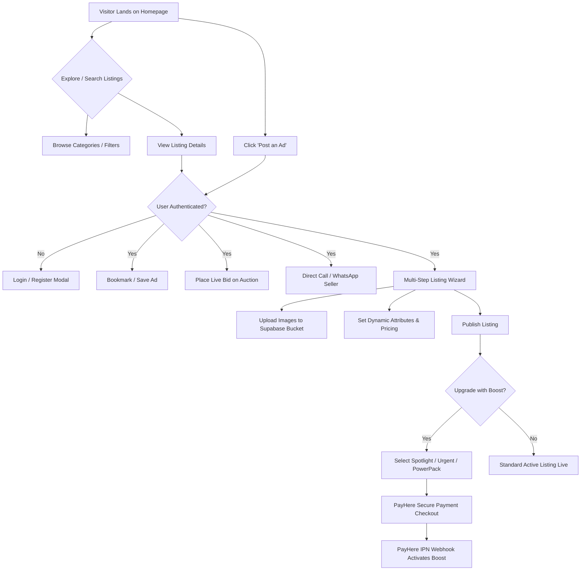

# WUDO — We Do Deals

<div align="center">
  
  <p><strong>A Modern, High-Performance Full-Stack Community Marketplace & Live Auction Platform</strong></p>
  <p><em>Buy, Sell, Bid, and Boost Local Classifieds with Trust and Transparency.</em></p>

  [](https://nextjs.org/)
  [](https://spring.io/projects/spring-boot)
  [](https://www.oracle.com/java/)
  [](https://www.typescriptlang.org/)
  [](https://www.postgresql.org/)
  [](https://supabase.com/)
  [](https://www.payhere.lk/)
  [](https://www.docker.com/)
</div>

---

## Table of Contents

- [1. Executive Summary](#1-executive-summary)
- [2. System Architecture](#2-system-architecture)
- [3. Complete Tech Stack](#3-complete-tech-stack)
- [4. User Journey \& Workflows](#4-user-journey--workflows)
- [5. Application Screens \& Feature Catalog](#5-application-screens--feature-catalog)
  - [5.1. Authentication \& Account Management](#51-authentication--account-management)
  - [5.2. Dashboard \& Homepage](#52-dashboard--homepage)
  - [5.3. Explore \& Advanced Listing Discovery](#53-explore--advanced-listing-discovery)
  - [5.4. Listing Detail \& Interactive Auction Hub](#54-listing-detail--interactive-auction-hub)
  - [5.5. Listing Creation \& Multi-Step Wizard](#55-listing-creation--multi-step-wizard)
  - [5.6. Seller Studio \& My Listings](#56-seller-studio--my-listings)
  - [5.7. Monetization, Boost Packages \& Payment Gateway](#57-monetization-boost-packages--payment-gateway)
  - [5.8. Public Seller Profiles \& Reputation](#58-public-seller-profiles--reputation)
  - [5.9. Legal, Compliance \& Safety Center](#59-legal-compliance--safety-center)
- [6. REST API Documentation](#6-rest-api-documentation)
- [7. Database Schema \& Entity Relationships](#7-database-schema--entity-relationships)
- [8. Security, Authorization \& Session Flow](#8-security-authorization--session-flow)
- [9. Local Development Setup](#9-local-development-setup)
- [10. Production Deployment Guide](#10-production-deployment-guide)
- [11. Privacy Policy \& Terms Summary](#11-privacy-policy--terms-summary)
- [12. License \& Authors](#12-license--authors)

---

## 1. Executive Summary

**WUDO ("We Do Deals")** is an enterprise-grade, end-to-end community marketplace and classified advertisement ecosystem designed for modern local commerce. Tailored initially for Sri Lanka and scalable globally, WUDO eliminates friction in secondary and local commerce through:

- **Interactive Category Filtering**: Dynamic multi-attribute filtering mapped to hierarchical category schemas (vehicles, electronics, real estate, services, etc.).
- **Live In-Feed Auctions**: Time-boxed competitive bidding with automatic reserve validation and privacy-protected bid histories.
- **Monetization Engine**: Tiered listing promotion packages (**Spotlight**, **Urgent**, **Push-Up**, and **PowerPack**) integrated with the **PayHere payment gateway** via secure webhooks and IPN (Instant Payment Notification).
- **Direct Buyer-Seller Engagement**: Instant WhatsApp and telephone click-to-contact links without intermediaries.
- **Verified Profiles & Trust Badges**: Multi-tier seller verification and profile management to minimize scams and fraudulent listings.

---

## 2. System Architecture

WUDO is architected with a clean decoupled model:

```
                      +------------------------------------------+
                      |         WUDO NEXT.JS FRONTEND            |
                      |   (Turbopack, TailwindCSS, React Hooks)  |
                      +--------------------+---------------------+
                                           |
                    +----------------------+----------------------+
                    | HTTPS REST (JWT Bearer)                     | HTTPS SDK
                    v                                             v
+---------------------------------------+       +------------------------------------+
|       SPRING BOOT 4.x BACKEND         |       |         SUPABASE SERVICES          |
|---------------------------------------|       |------------------------------------|
| - REST Controllers & Spring Security  |       | - Supabase Auth (OAuth / JWT)      |
| - Data JPA / Hibernate ORM Layer      |       | - Supabase Storage (S3 S3-compat)  |
| - PayHere Webhook & Boost Engine      |       |   - 'listing-images' bucket        |
| - Flyway Schema Migrations (v1 - v34) |       |   - 'profile-images' bucket        |
| - HikariCP Connection Pool            |       | - Row-Level Security Policies      |
+-------------------+-------------------+       +-----------------+------------------+
                    |                                             |
                    +----------------------+----------------------+
                                           |
                                           v
                       +---------------------------------------+
                       |    SUPABASE POSTGRESQL 17 DATABASE    |
                       |    (Connected via Supavisor Pooler)   |
                       +---------------------------------------+
```

---

## 3. Complete Tech Stack

### Frontend
- **Framework**: [Next.js 16 (App Router)](https://nextjs.org/) with React 19 & Turbopack.
- **Language**: TypeScript (Strict Mode).
- **Styling**: Vanilla CSS & [TailwindCSS 4](https://tailwindcss.com/) with responsive dark mode and custom curated palettes.
- **Icons**: [React Icons (FontAwesome / Fa)](https://react-icons.github.io/react-icons/) and [Lucide React](https://lucide.dev/).
- **Animation**: Micro-interactions, framer motion components, and fluid UI layout transitions.
- **State & Client Libraries**: Custom React Context Providers (`AuthProvider`, `ToastProvider`), Supabase JS Client (`@supabase/supabase-js`, `@supabase/ssr`).

### Backend
- **Framework**: [Spring Boot 4.1.0](https://spring.io/projects/spring-boot) / [Java 25](https://www.oracle.com/java/).
- **Security**: Spring Security with Stateless JWT Filter (`JwtAuthenticationFilter`), BCrypt password hashing, and granular CORS mapping.
- **ORM & Data**: Spring Data JPA, Hibernate ORM 7.x, PostgreSQL Dialect.
- **Migrations**: [Flyway Database Migrations](https://flywaydb.org/) (34 structured SQL version scripts).
- **Connection Pool**: HikariCP with optimized pooling timeouts for cloud execution.
- **Documentation**: SpringDoc OpenAPI 3.x / Swagger UI.

### Database, Storage & Payments
- **Database**: PostgreSQL 17 managed via Supabase with custom JSONB schema columns for category attributes.
- **Storage**: Supabase Storage S3-compatible cloud object buckets (`listing-images`, `profile-images`).
- **Payment Gateway**: [PayHere LK Sandbox & Production API](https://www.payhere.lk/) with MD5 signature validation and automated IPN webhook reconciliation.
- **Deployment**: Docker containerization with multi-stage JRE runtime builds.

---

## 4. User Journey & Workflows



---

## 5. Application Screens & Feature Catalog

### 5.1. Authentication & Account Management
| Screen / Route | Description & Features |
| :--- | :--- |
| **Login** (`/login`) | Clean credentials form with email/password, automated redirect handling via `redirect` query param, and instant error alerts. |
| **Register** (`/register`) | User registration with username availability checking, password strength indicator, email validation, and profile creation. |
| **Forgot Password** (`/forgot-password`) | Initiates password reset magic links through Supabase Auth. |
| **Reset Password** (`/reset-password`) | Secure token validation and new password entry screen. |
| **Account Settings** (`/settings`) | Avatar & banner photo uploads, personal details update, phone number verification, password modification, and account deletion. |
| **Become a Seller** (`/become-a-seller`) | Dedicated onboarding workflow for upgrading standard users to verified seller accounts. |

---

### 5.2. Dashboard & Homepage (`/`)
- **Dashboard Hero Section**:
  - Rotating text animation (`phones`, `vehicles`, `property`, `gadgets`, `services`) with neighborhood search.
  - Category search bar with auto-completing suggestion dropdown.
  - Quick-filter chips for popular keywords (e.g. *iPhone 15*, *Alto K10*, *Land in Kandy*).
  - Trust indicators highlighting **Verified Profiles**, **Live Bidding**, and **Direct Contact**.
- **Browse by Category (2-Way Slider & Grid)**:
  - Horizontal smooth category selector with icon representation.
  - Active category tab highlighting filtered items.
  - Responsive **2x2 card grid** layout optimized for mobile screens and compact horizontal cards for desktop.
  - "View All" direct routing to filtered search pages.
- **Spotlight & Urgent Showcases**:
  - Golden Spotlight carousel cards with secondary image hover-scrubbing.
  - High-priority Urgent cards with gradient badges.
- **PowerPack Feature Cards**:
  - Full-width dual-column mosaic cards showcasing multi-image collages (hero photo + dual mini thumbnails + "+X more" overlay).
  - In-feed Call, WhatsApp, and Quick View actions.
- **Latest Listings Grid**:
  - 12-item paginated grid with instant bookmark toggling, price formatters, relative time ago (`3h ago`, `2d ago`), and location pills.

---

### 5.3. Explore & Advanced Listing Discovery (`/listings`)
- **Faceted Filter Sidebar**:
  - **Category Hierarchy**: Root category expanders with subcategory selection.
  - **Location Selector**: Dual-tier dropdowns for Sri Lankan Provinces and Districts.
  - **Price Range Slider**: Numeric inputs with minimum and maximum filters.
  - **Condition Pills**: *Brand New*, *Like New*, *Good*, *Fair*, *For Parts*, *Refurbished*.
  - **Promotion Filters**: Toggle to view only Spotlight, Urgent, or Auction items.
- **Sorting Options**: `Newest First`, `Price: Low to High`, `Price: High to Low`, `Most Active Bids`.
- **View Modes**: Dynamic toggle between compact Grid view and detailed Row view.

---

### 5.4. Listing Detail & Interactive Auction Hub (`/listings/[id]`)
- **Photo Gallery & Lightbox**: Main high-resolution image preview with thumbnail navigation and zoom controls.
- **Structured Specification Pills**: Automatically renders dynamic category attributes (e.g., *Engine Capacity: 1500cc*, *Mileage: 45,000 km*, *Bedrooms: 3*).
- **Direct Seller Contact Module**: One-tap `Call Seller` phone link and formatted `Chat on WhatsApp` link.
- **Live Auction & Bidding Panel**:
  - Real-time countdown timer to auction close.
  - Starting bid, current highest bid, and minimum bid increment tracker.
  - Bid submission input with instant validation.
  - Complete bid history modal with seller privacy mode (masked bidder identities).
- **Location & Map Overview**: District and city location badges.
- **Related Category Recommendations**: Carousel of similar active items.

---

### 5.5. Listing Creation & Multi-Step Wizard (`/listings/new`)
1. **Category Selection**: Hierarchical picker determining required dynamic attributes.
2. **Core Information**: Title, condition, price type (*Fixed*, *Negotiable*, *Free*, *Contact for Price*), amount, and rich description.
3. **Dynamic Custom Attributes**: Form fields dynamically generated according to category schema (dropdowns, numbers, booleans, text).
4. **Media Upload**: Multi-file dropzone with drag-and-drop, primary image designation, and reordering.
5. **Auction Configuration (Optional)**: Enable live bidding, starting price, reserve price, and auction duration.
6. **Location & Seller Details**: Primary contact phone, WhatsApp number, and district/city selection.

---

### 5.6. Seller Studio & My Listings (`/my-listings`)
- **Tabbed Organization**: Filter listings by `Active`, `Draft`, `Sold`, and `Expired`.
- **Quick Action Bar**:
  - **Edit Listing**: Instant link to `/listings/[id]/edit`.
  - **Boost Listing**: Opens the listing promotion modal.
  - **Status Toggles**: Mark as Sold, unpublish to Draft, or delete.
  - **Auction Management**: View active bidder bids and conclude auctions early.
- **Bookmarks Page (`/bookmarks`)**: Centralized repository of all saved listings.

---

### 5.7. Monetization, Boost Packages & Payment Gateway (`/boost`, `/promotions`)

WUDO provides 4 high-impact promotion tiers to help sellers maximize reach:

| Package | Badge & Visual Treatment | Key Benefits | Duration |
| :--- | :--- | :--- | :--- |
| **Spotlight** | Golden border, top carousel pin, 2nd photo hover scrub | Featured at the very top of home & search feeds | 3 - 15 Days |
| **Urgent** | Red border & ribbon badge, animated flame icon | Highlights deals needing immediate sale | 3 - 15 Days |
| **Push-Up** | Green border, daily bump to the top of listings | Automatically bumps listing back to page 1 | 7 Days |
| **PowerPack** | Violet glow, 3-photo mosaic collage, direct Call/WhatsApp | Combines Spotlight + Urgent + Push-Up in 1 package | 7 - 30 Days |

#### PayHere Payment Integration Flow:
1. Seller selects listing and desired boost package on `/boost` or `/promotions`.
2. Frontend requests `/api/v1/boosts/checkout` from Spring Boot.
3. Backend generates PayHere transaction metadata with secure MD5 hash verification.
4. User completes payment via Credit Card, Debit Card, or Mobile Wallet.
5. PayHere server triggers IPN webhook to `/api/v1/boosts/notify`.
6. Backend validates MD5 checksum and updates listing boost flags (`is_spotlight`, `is_urgent`, `is_pushed_up`) and expiry timestamps.

---

### 5.8. Public Seller Profiles & Reputation (`/profile/[username]`)
- **Verified Seller Header**: Avatar, cover banner, verification badge, member since date, and location.
- **Seller Inventory**: Filterable grid displaying all active ads posted by this specific seller.
- **Safety Badge**: Verification status confirming verified email and contact details.

---

### 5.9. Legal, Compliance & Safety Center
- **Privacy Policy (`/privacy-policy`)**: Exhaustive disclosure on personal data handling, cookies, telemetry, storage policies, and user deletion rights.
- **Terms of Service (`/terms-of-service`)**: Marketplace rules, prohibited items, auction obligations, seller guarantees, and liability disclaimers.
- **Support & Help Center (`/support`)**: Contact channels, FAQs, reporting fraud, and dispute escalation.

---

## 6. REST API Documentation

### 6.1. Authentication & Users
| Method | Endpoint | Access | Description |
| :--- | :--- | :--- | :--- |
| `POST` | `/api/v1/auth/sync` | Authenticated | Synchronizes Supabase session with local database user record. |
| `GET` | `/api/v1/auth/me` | Authenticated | Returns current authenticated user and role. |
| `GET` | `/api/v1/users/me` | Authenticated | Retrieves detailed user profile and stats. |
| `PATCH`| `/api/v1/users/me` | Authenticated | Updates bio, phone, location, and preferences. |
| `DELETE`| `/api/v1/users/me` | Authenticated | Deletes account and associated records. |
| `POST` | `/api/v1/users/become-seller` | Authenticated | Upgrades user profile to verified seller status. |
| `GET` | `/api/v1/users/check-username` | Public | Checks if a requested username is available. |
| `GET` | `/api/v1/users/{username}` | Public | Returns public seller profile and listing counts. |
| `POST` | `/api/v1/users/me/images/avatar` | Authenticated | Uploads user avatar image to Supabase bucket. |
| `POST` | `/api/v1/users/me/images/banner` | Authenticated | Uploads profile banner cover image. |

### 6.2. Categories
| Method | Endpoint | Access | Description |
| :--- | :--- | :--- | :--- |
| `GET` | `/api/v1/categories` | Public | Returns all active categories. |
| `GET` | `/api/v1/categories/root` | Public | Returns top-level root categories. |
| `GET` | `/api/v1/categories/{slug}` | Public | Retrieves category details by slug. |
| `GET` | `/api/v1/categories/{id}/subcategories` | Public | Lists child subcategories for a given parent ID. |
| `GET` | `/api/v1/categories/{id}/attributes` | Public | Returns dynamic custom attribute schema for category. |

### 6.3. Listings & Media
| Method | Endpoint | Access | Description |
| :--- | :--- | :--- | :--- |
| `GET` | `/api/v1/listings` | Public | Search, paginate, and filter listings with faceted criteria. |
| `GET` | `/api/v1/listings/{idOrSlug}` | Public | Retrieves full listing metadata, images, and auction status. |
| `POST` | `/api/v1/listings` | Authenticated | Creates a new draft or published listing. |
| `PUT` | `/api/v1/listings/{id}` | Authenticated | Updates an existing listing. |
| `DELETE`| `/api/v1/listings/{id}` | Authenticated | Deletes listing and associated cloud images. |
| `PATCH`| `/api/v1/listings/{id}/status` | Authenticated | Updates status (`ACTIVE`, `DRAFT`, `SOLD`, `ARCHIVED`). |
| `POST` | `/api/v1/listings/{idOrSlug}/bookmark` | Authenticated | Toggles bookmark status for the authenticated user. |
| `GET` | `/api/v1/listings/my-listings` | Authenticated | Returns listings created by the logged-in user. |
| `GET` | `/api/v1/listings/bookmarks` | Authenticated | Returns saved/bookmarked listings for the user. |
| `POST` | `/api/v1/listings/{id}/images` | Authenticated | Uploads listing photos to Supabase Storage bucket. |
| `DELETE`| `/api/v1/listings/{id}/images/{imageId}` | Authenticated | Deletes a specific listing image. |
| `PATCH`| `/api/v1/listings/{id}/images/{imageId}/primary` | Authenticated | Sets an image as the primary cover thumbnail. |

### 6.4. Auctions & Bidding
| Method | Endpoint | Access | Description |
| :--- | :--- | :--- | :--- |
| `GET` | `/api/v1/listings/{id}/auction` | Public | Retrieves auction timer, current bid, and reserve state. |
| `POST` | `/api/v1/listings/{id}/auction` | Authenticated | Configures a new auction on a listing. |
| `POST` | `/api/v1/listings/{id}/auction/bids` | Authenticated | Places a new valid bid on an active auction. |
| `GET` | `/api/v1/listings/{id}/auction/bids` | Public / Auth | Retrieves historical bids (masked for privacy). |
| `POST` | `/api/v1/listings/{id}/auction/end` | Authenticated | Concludes auction and declares winning bidder. |

### 6.5. Boosts & Monetization
| Method | Endpoint | Access | Description |
| :--- | :--- | :--- | :--- |
| `GET` | `/api/v1/boosts/packages` | Public | Lists active promotion tiers, features, and pricing. |
| `POST` | `/api/v1/boosts/checkout` | Authenticated | Initializes PayHere payment transaction payload. |
| `POST` | `/api/v1/boosts/notify` | Public (Webhook) | PayHere IPN webhook for signature validation and activation. |
| `GET` | `/api/v1/boosts/my-subscriptions`| Authenticated | Retrieves past promotion purchase history. |

---

## 7. Database Schema & Entity Relationships

The PostgreSQL database is organized into normalized relational tables managed via Flyway:

```
[ users ] 1 --- * [ listings ]
                       | 1
                       + --- * [ listing_images ]
                       + --- 1 [ auctions ] 1 --- * [ bids ]
                       + --- * [ listing_promotions ]
                       + --- * [ listing_bookmarks ] * --- 1 [ users ]

[ categories ] 1 --- * [ categories (subcategories) ]
[ categories ] 1 --- * [ category_attributes ]
[ categories ] 1 --- * [ listings ]
```

### Core Tables:
- `users`: Core profile metadata, verification badges, contact info, timestamps.
- `categories`: Tree hierarchy (`parent_id`), slugs, icons, active status.
- `category_attributes`: Attribute name, type (`TEXT`, `NUMBER`, `SELECT`, `BOOLEAN`), unit, and validation rules.
- `listings`: Titles, slugs, description, price, pricing type, condition, district, city, custom attributes JSONB, boost flags (`is_spotlight`, `is_urgent`, `is_pushed_up`, `boost_expires_at`), view counts.
- `listing_images`: Image URL, display order, primary flag, Supabase bucket path.
- `auctions`: Starting bid, reserve price, minimum increment, start/end timestamps, auction status (`ACTIVE`, `COMPLETED`, `CANCELLED`).
- `bids`: Auction ID, user ID, bid amount, timestamp, winning flag.
- `promotions` & `listing_promotions`: Promotion tier, duration, payment status, PayHere payment ID, expiry date.

---

## 8. Security, Authorization & Session Flow

1. **Stateless JWT Verification**: User signs in on the frontend via Supabase. The Supabase JWT is forwarded in the `Authorization: Bearer <token>` header to the Spring Boot backend.
2. **`JwtAuthenticationFilter`**: Validates the cryptographic token signature, extracts the user ID/claims, and sets the `SecurityContextHolder` principal.
3. **Row-Level Authorization**: Services verify that update and delete operations on listings, images, and auctions belong strictly to the authenticated listing owner.
4. **PayHere Signature Verification**: All webhook notifications verify the incoming MD5 checksum (`merchant_id + order_id + payhere_amount + payhere_currency + status_code + strtoupper(md5(merchant_secret))`) before modifying boost records.
5. **CORS Hardening**: Strict origin whitelisting allowing authorized local development addresses and production domains (`wudo-two.vercel.app`).

---

## 9. Local Development Setup

### Prerequisites
- **JDK 21+** (Java 25 recommended)
- **Node.js 18+** & **npm**
- **Git**
- **PostgreSQL 15+** (or Supabase project)

### 1. Clone the Repository
```bash
git clone https://github.com/ShadhirFawz/Ad-portal.git
cd Ad-portal
```

### 2. Backend Configuration
1. Navigate to `backend/src/main/resources/application-dev.yml`.
2. Configure your database and Supabase credentials:
   ```yaml
   spring:
     datasource:
       url: jdbc:postgresql://localhost:5432/marketplace_db
       username: postgres
       password: your_postgres_password
   
   supabase:
     url: https://your-project.supabase.co
     secret-key: your-supabase-secret-key
   
   payhere:
     merchant-id: your_merchant_id
     merchant-secret: your_merchant_secret
   ```
3. Run backend with Maven:
   ```bash
   cd backend
   ./mvnw spring-boot:run
   ```
   *The backend will boot on `http://localhost:8080` (API endpoint: `http://localhost:8080/api/v1`).*

### 3. Frontend Configuration
1. Navigate to the `frontend/` directory.
2. Create or verify `frontend/.env`:
   ```env
   NEXT_PUBLIC_API_URL=http://localhost:8080/api/v1
   NEXT_PUBLIC_SUPABASE_URL=https://your-project.supabase.co
   NEXT_PUBLIC_SUPABASE_ANON_KEY=your_supabase_anon_key
   ```
3. Install dependencies and start development server:
   ```bash
   cd frontend
   npm install
   npm run dev
   ```
   *Access the web application at `http://localhost:3000`.*

---

## 10. Production Deployment Guide

### Backend Deployment (Docker / Cloud Platforms)
The backend includes a multi-stage `Dockerfile`:
```dockerfile
# Build image
docker build -t wudo-backend:latest ./backend

# Run container
docker run -p 8080:8080 \
  -e SPRING_PROFILES_ACTIVE=prod \
  -e SPRING_DATASOURCE_URL=jdbc:postgresql://your-pooler-host:5432/postgres \
  -e SPRING_DATASOURCE_USERNAME=postgres.your-ref \
  -e SPRING_DATASOURCE_PASSWORD=your-db-password \
  -e JWT_SECRET=your-jwt-secret \
  -e SUPABASE_URL=https://your-project.supabase.co \
  -e SUPABASE_SECRET_KEY=your-supabase-secret \
  wudo-backend:latest
```

### Frontend Deployment (Vercel)
1. Push the repository to GitHub.
2. Import the `frontend` directory into **Vercel**.
3. Set environment variables in Vercel project settings:
   - `NEXT_PUBLIC_API_URL`: `https://your-backend-domain.com/api/v1`
   - `NEXT_PUBLIC_SUPABASE_URL`: `https://your-project.supabase.co`
   - `NEXT_PUBLIC_SUPABASE_ANON_KEY`: `your_anon_key`
4. Deploy.

---

## 11. Privacy Policy & Terms Summary

### Privacy Policy Overview
- **Data Collection**: Collects registration details (name, email, phone number) solely for identity verification and communication between transacting parties.
- **Location Data**: City and district names are stored strictly to power geographical listing discovery. Precise GPS telemetry is never broadcasted publicly.
- **Media Assets**: Photos uploaded to listings and user profiles are stored in secure cloud buckets with access restricted to listing visibility.
- **User Control**: Full rights to modify personal details, unpublish ads, export listings, and permanently delete accounts at any time.

### Terms of Service Overview
- **Community Standards**: Strict prohibition of counterfeit merchandise, illegal goods, offensive content, and deceptive pricing.
- **Auction Integrity**: All placed bids constitute a bona fide commitment to transact. Shilling, self-bidding, and artificial price inflation are strictly forbidden.
- **Safety Guidelines**: Buyers and sellers are advised to inspect items in public locations and verify goods prior to financial exchanges.

---

## 12. License & Authors

Developed and maintained by **Shadhir Fawz**.

- **GitHub Repository**: [https://github.com/ShadhirFawz/Ad-portal](https://github.com/ShadhirFawz/Ad-portal)
- **Live Application**: [https://wudo-two.vercel.app/](https://wudo-two.vercel.app/)

